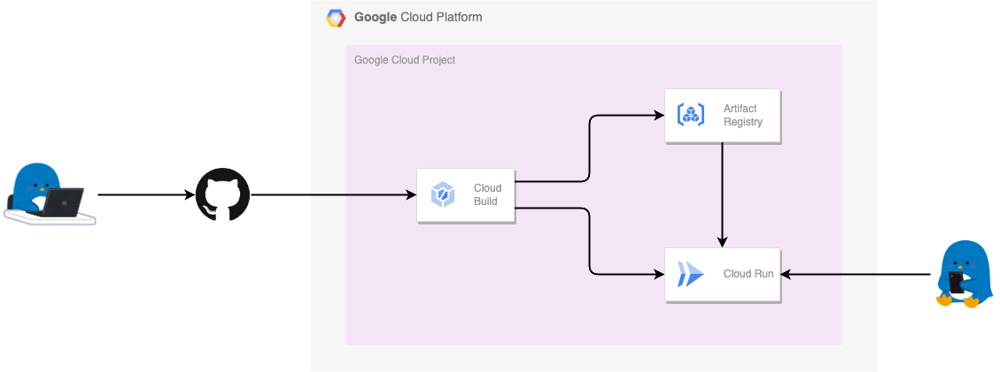

# Hands On Cloud Build

Cloud Build のハンズオン集です :)

## [Cloud Build ---> Cloud Run のサンプル( Artifact Registry )](./samples-ar-run/)

GitHub と連携した Cloud Build から Cloud Run にサンプルアプリケーションをデプロイします

Cloud Run で使うコンテナイメージの保存先は Artifact Registry を利用します

## memo

公式のサンプルコンテナ
us-docker.pkg.dev/cloudrun/container/hello

