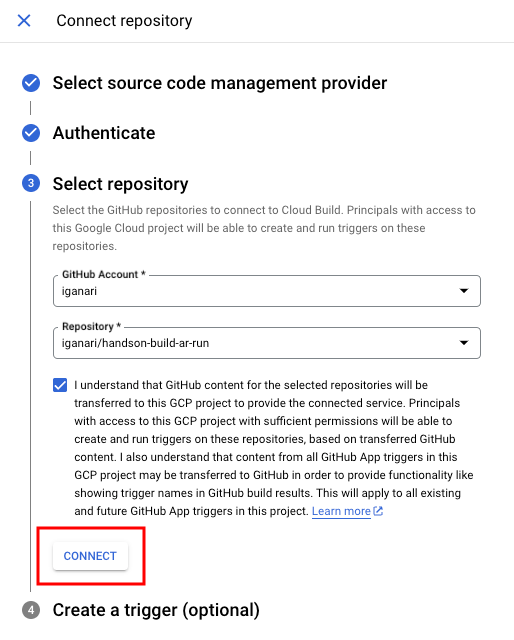

# Hands On Deploy from Cloud Build to Cloud Run( using Artifact Registry )

## 概要

GitHub と連携した Cloud Build から Cloud Run にサンプルアプリケーションをデプロイします

Cloud Run で使うコンテナイメージの保存先は Artifact Registry を利用します


## やってみる

### 0. 準備

```
export _gc_pj_id='Your Google Cloud Project ID'
export _common='hnd-cb-sample'
```

+ Google Cloud と認証をする

```
gcloud auth login --no-launch-browser
```

+ ローカルの Docker の設定をアップデートする
  + https://cloud.google.com/artifact-registry/docs/docker/authentication

```
gcloud auth configure-docker asia-northeast1-docker.pkg.dev
```

+ API の有効化

```
gcloud beta services enable artifactregistry.googleapis.com --project ${_gc_pj_id}
gcloud beta services enable cloudbuild.googleapis.com --project ${_gc_pj_id}
```

+ ソースコードを clone する

```
git clone https://github.com/iganari/handson-build-ar-run.git
cd handson-build-ar-run
```

### 1. Service Account の作成と Role の付与

+ Cloud Build 用の Service Account の作成

```
gcloud beta iam service-accounts create sa-${_common}-cloudbuild \
  --description="Cloud Build Trigger 毎に Service Account を付与する" \
  --display-name="sa-${_common}-cloudbuild" \
  --project ${_gc_pj_id}
```

+ Service Account の確認

```
gcloud beta iam service-accounts describe \
  sa-${_common}-cloudbuild@${_gc_pj_id}.iam.gserviceaccount.com \
  --project ${_gc_pj_id} \
  --format json
```

+ Role を付与する
  + Logs Writer( `roles/logging.logWriter` )
  + Storage Admin( `roles/storage.admin` )
  + Artifact Registry Writer( `roles/artifactregistry.writer` )
  + Cloud Run Developer( `roles/run.developer` )
  + Service Account User( `roles/iam.serviceAccountUser` ) 

```
### Logs Writer
gcloud beta projects add-iam-policy-binding ${_gc_pj_id} \
  --member="serviceAccount:sa-${_common}-cloudbuild@${_gc_pj_id}.iam.gserviceaccount.com" \
  --role="roles/logging.logWriter" \
  --project ${_gc_pj_id}

### Storage Admin
gcloud beta projects add-iam-policy-binding ${_gc_pj_id} \
  --member="serviceAccount:sa-${_common}-cloudbuild@${_gc_pj_id}.iam.gserviceaccount.com" \
  --role="roles/storage.admin" \
  --project ${_gc_pj_id}

### Artifact Registry Writer
gcloud beta projects add-iam-policy-binding ${_gc_pj_id} \
  --member="serviceAccount:sa-${_common}-cloudbuild@${_gc_pj_id}.iam.gserviceaccount.com" \
  --role="roles/artifactregistry.writer" \
  --project ${_gc_pj_id}

### Cloud Run Admin
gcloud beta projects add-iam-policy-binding ${_gc_pj_id} \
  --member="serviceAccount:sa-${_common}-cloudbuild@${_gc_pj_id}.iam.gserviceaccount.com" \
  --role="roles/run.admin" \
  --project ${_gc_pj_id}

### Service Account User
gcloud beta projects add-iam-policy-binding ${_gc_pj_id} \
  --member="serviceAccount:sa-${_common}-cloudbuild@${_gc_pj_id}.iam.gserviceaccount.com" \
  --role="roles/iam.serviceAccountUser" \
  --project ${_gc_pj_id}
```


+ Cloud Run 用の Service Account の作成

```
gcloud beta iam service-accounts create sa-${_common}-cloudrun \
  --description="Cloud Run 毎に Service Account を付与する" \
  --display-name="sa-${_common}-cloudbuild" \
  --project ${_gc_pj_id}
```

+ Service Account の確認

```
gcloud beta iam service-accounts describe \
  sa-${_common}-cloudbuild@${_gc_pj_id}.iam.gserviceaccount.com \
  --project ${_gc_pj_id} \
  --format json
```

+ Role を付与する

```
今の所無し
```

### 2. Google Cloud Storage Bucket の作成

```
export _region='asia-northeast1'
```
```
gcloud storage buckets create gs://${_gc_pj_id}-${_common} \
  --default-storage-class Standard \
  --location ${_region} \
  --uniform-bucket-level-access \
  --project ${_gc_pj_id}
```

### 3. Artifact Registry のリポジトリの作成

```
export _ar_repo_name=`echo ar-${_common}`
```
```
gcloud beta artifacts repositories create ${_ar_repo_name} \
  --repository-format docker \
  --location ${_region} \
  --project ${_gc_pj_id}
```

### 4. GitHub と Cloud Build の連携設定

Google Cloud と GitHub を連携する

```
### GitHub リポジトリに接続する
https://cloud.google.com/build/docs/automating-builds/github/connect-repo-github
```





### 4. Cloud Build Trigger の作成

```
gcloud builds triggers create github \
  --name cb-tr-${_common} \
  --service-account projects/${_gc_pj_id}/serviceAccounts/sa-${_common}-cloudbuild@${_gc_pj_id}.iam.gserviceaccount.com \
  --repo-owner iganari \
  --repo-name handson-build-ar-run \
  --branch-pattern '^main$' \
  --build-config ./cloudbuild.yaml \
  --project ${_gc_pj_id} \
  --substitutions _ARTIFACT_RRGISTRY_REPO_NAME=${_region}-docker.pkg.dev/${_gc_pj_id}/${_ar_repo_name},_CONTAINER_IMAGE_NAME=${_common},_RUN_SERVICE_NAME=run-${_common},_RUN_SERVICE_REGION=${_region},_RUN_SERVICE_PORT=80,_GCS_BUCKET=${_gc_pj_id}-${_common},_SERVICE_ACCOUNT=sa-${_common}-cloudrun@${_gc_pj_id}.iam.gserviceaccount.com
```

### 99. クリーンアップ

<details>
<summary>Cloud Run の Service の削除</summary>

```
gcloud run services delete run-${_common} --region ${_region} --project ${_gc_pj_id}
```

</details>

<details>
<summary>Cloud Build の Trigger の削除</summary>

```
gcloud builds triggers delete cb-tr-${_common} --project ${_gc_pj_id}
```

</details>

<details>
<summary>Artifact Registry の Repository の削除</summary>

```
gcloud beta artifacts repositories delete ${_ar_repo_name} \
  --location ${_region} \
  --project ${_gc_pj_id}
```

</details>

<details>
<summary>Google Cloud Storage の Bucket の削除</summary>

```
gcloud storage rm -r gs://${_gc_pj_id}-${_common} --project ${_gc_pj_id}
```

</details>

<details>
<summary>Service Account の削除</summary>

```
### Logs Writer
gcloud beta projects remove-iam-policy-binding ${_gc_pj_id} \
  --member="serviceAccount:sa-${_common}-cloudbuild@${_gc_pj_id}.iam.gserviceaccount.com" \
  --role="roles/logging.logWriter" \
  --project ${_gc_pj_id}

### Storage Admin
gcloud beta projects remove-iam-policy-binding ${_gc_pj_id} \
  --member="serviceAccount:sa-${_common}-cloudbuild@${_gc_pj_id}.iam.gserviceaccount.com" \
  --role="roles/storage.admin" \
  --project ${_gc_pj_id}

### Artifact Registry Writer
gcloud beta projects remove-iam-policy-binding ${_gc_pj_id} \
  --member="serviceAccount:sa-${_common}-cloudbuild@${_gc_pj_id}.iam.gserviceaccount.com" \
  --role="roles/artifactregistry.writer" \
  --project ${_gc_pj_id}

### Cloud Run Admin
gcloud beta projects remove-iam-policy-binding ${_gc_pj_id} \
  --member="serviceAccount:sa-${_common}-cloudbuild@${_gc_pj_id}.iam.gserviceaccount.com" \
  --role="roles/run.admin" \
  --project ${_gc_pj_id}

### Service Account User
gcloud beta projects remove-iam-policy-binding ${_gc_pj_id} \
  --member="serviceAccount:sa-${_common}-cloudbuild@${_gc_pj_id}.iam.gserviceaccount.com" \
  --role="roles/iam.serviceAccountUser" \
  --project ${_gc_pj_id}


gcloud beta iam service-accounts delete sa-${_common}-cloudbuild@${_gc_pj_id}.iam.gserviceaccount.com \
  --project ${_gc_pj_id}

gcloud beta iam service-accounts delete sa-${_common}-cloudrun@${_gc_pj_id}.iam.gserviceaccount.com \
  --project ${_gc_pj_id}
```

</details>

